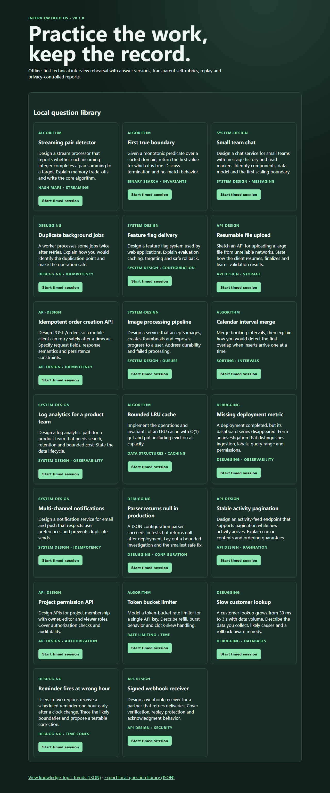

# Interview Dojo OS

[](https://github.com/KanadeK/interview-dojo-os/actions/workflows/ci.yml) [](LICENSE) [](https://github.com/KanadeK/interview-dojo-os/releases)

**v0.1.0** — a local-first practice system for technical interviews. It records the work you did, not a pretend hiring verdict: timed sessions, answer versions, transparent self-rubrics, replay, topic trends and privacy-controlled exports.



- Keep practice data in a local SQLite file.
- Replay exactly when answers and self-assessments changed.
- Export a report without your answer unless you explicitly include it.

## Fast start

```bash
npm ci
npm run dev
```

Open http://localhost:3000, choose a question, save an answer version, then record the rubric. The included 20-question JSON pack is automatically imported into the local database on first use.

## Real input → output

The committed pack (`examples/original-question-pack.json`) is a valid input. A report output from it looks like:

```json
{
  "question": { "id": "two-sum-stream", "topics": ["hash maps", "streaming"] },
  "rubric": { "transparent": true, "selfAssessmentOnly": true, "score": { "scorePercent": 75 } },
  "answer": null
}
```

`answer` is `null` unless the learner selects **Include the latest local answer** before downloading a report.

## Features

- Import validated JSON question packs through `POST /api/questions`.
- Create a timed coding/design session with durable answer versions and a timestamped timeline.
- Apply visible 0–4, weighted rubric criteria as a self-assessment; it never claims to be a hiring decision.
- Review topic trends computed from completed rubric scores.
- Download local reports and export the question library as JSON.

## Architecture

Next.js routes and components are thin adapters over `src/domain/` (validation, scoring, time) and `src/server/` (SQLite/Drizzle boundary and repository). The domain logic is network-free and has deterministic clock-driven tests. Read [the architecture note](docs/ARCHITECTURE.md).

## Install, test, package

```bash
npm ci
npm run lint && npm run typecheck && npm run test:coverage && npm run test:e2e && npm run build
npm run package
make verify
make demo
make package
make release-check
```

On systems without `make`, use `npm run verify`, `npm run demo`, `npm run package`, and `npm run release-check` directly. `npm run demo` writes an actual report from the committed sample pack to `dist-release/demo-report.json`.

## Privacy and security

The default database is `data/interview-dojo.db` on your machine. No cloud service, analytics SDK or account is required. Reports omit answer text by default. Read [Privacy and Security](docs/PRIVACY_AND_SECURITY.md) before importing third-party packs.

## Non-goals

This project is not an automated hiring evaluator, proctoring service, cloud sync product, or source of proprietary interview questions.

## Sample data

All 20 sample questions and rubrics are original synthetic material licensed under MIT with this repository. They span algorithms, debugging, API design and system design.

## Competitor difference

An [open-repository sample scan](docs/COMPETITOR_SCAN.md) found study collections, hiring rubrics and cloud AI co-pilots. Interview Dojo OS is deliberately smaller: offline SQLite persistence, answer-version replay, transparent manual scoring and default-redacted exports.

## Roadmap

v0.2.0 can add optional encrypted backups and user-authored question editing while retaining local-first operation.

## Contributing and FAQ

See [CONTRIBUTING.md](CONTRIBUTING.md), [SECURITY.md](SECURITY.md), and [CODE_OF_CONDUCT.md](CODE_OF_CONDUCT.md). Question packs are JSON objects with `version`, `name`, and `questions`; invalid packs are rejected with Zod validation errors.
